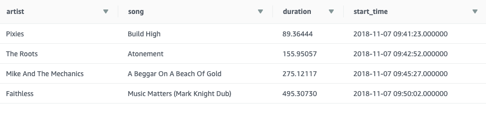
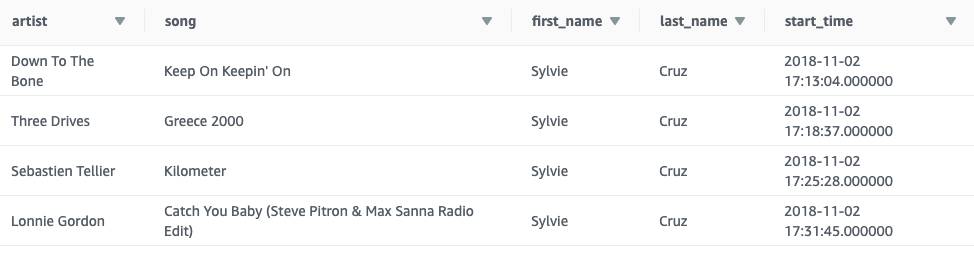
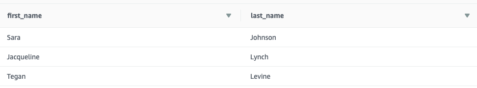

# Sparkify's Data Warehouse

The goal of this project is to build a data warehouse for the fictitious company Sparkify.
We want to build a database from songplay records and song metadata provided as JSON logs,
such that data scientists and analysts can more easily understand what songs their users
are listening to on their music streaming app in order to provide insights for critical
business decisions.

## Usage instructions

### Prerequisites

You will need a Python 3.7+ environment with the packages in
[requirements.txt](./requirements.txt). Also, you must have installed
[psycopg's requirements](https://www.psycopg.org/docs/install.html#build-prerequisites).

This project is organized in 3 scripts:
- `redshift.py`: CLI for creating and deleting redshift clusters;
- `create_tables.py`: creates all tables
  > **Warning**: this script will drop all existing tables!
- `etl.py`: extracts data from raw JSON files, transforms them to a star schema and loads
the results to the data warehouse
> **Attention**: all scripts depend on configuration files; see details below.

### Creating and deleting clusters

In order to run `redshift.py`, you will need AWS credentials allowing to create/delete
redshift clusters. On top of that, you must create an `admin.cfg` file similar to this
template:
```buildoutcfg
[AWS]
KEY=<AWS_ACCESS_KEY>
SECRET=<AWS_ACCESS_SECRET>
REGION=us-west-2

[DWH]
CLUSTER_TYPE=multi-node
NUM_NODES=5
NODE_TYPE=dc2.large

CLUSTER_IDENTIFIER=udacity-dend
DB_NAME=sparkifydb
DB_USER=student
DB_PASSWORD=<PASSWORD>
PORT=5439

IAM_ROLE_NAME=<IAM_ROLE_ALLOWING_REDSHIFT_TO_READ_FROM_S3>
SECURITY_GROUP_ID=<SECURITY_GROUP_ID_WITH_PROPER_INBOUND_AND_OUTBOUND_CONFIGURATIONS>
``` 
> You may alternatively specify a configuration file lying elsewhere by using the 
>`--config-file` argument. Run `python redshift.py --help` for details.

Cluster creation is accomplished by running `python redshift.py create`. If the cluster is
successfully created, the script prints the database's endpoint to the screen. Make sure
to get this URL information as it will be needed to run the ETL pipeline.

### Running the ETL pipeline

First, you will need AWS credentials with read access to S3 and full access to Redshift.

Running the ETL is accomplished by simply running `python create_tables.py` and then 
`python etl.py`. However, note that both scripts depend on a configuration file `./dwh.cfg`
which must be in the project's root directory; this configuration file looks like the
following:
```buildoutcfg
[AWS]
KEY=<AWS_ACCESS_KEY>
SECRET=<AWS_ACCESS_SECRET>

[CLUSTER]
HOST=<ENDPOINT_FROM_CREATE_CLUSTER_SCRIPT
DB_NAME=sparkifydb
DB_USER=student
DB_PASSWORD=<PASSWORD_FROM_CREATE_CLUSTER_CONFIG>
DB_PORT=5439

[IAM_ROLE]
ARN='<IAM_ROLE_ARN_USED_IN_CREATE_CLUSTER_SCRIPT>'

[S3]
LOG_DATA='s3://udacity-dend/log-data'
LOG_JSONPATH='s3://udacity-dend/log_json_path.json'
SONG_DATA='s3://udacity-dend/song-data'
```
> **Warning**: the whole ETL takes around 1 hour to be completed.

## Data warehouse design

The general design is built a star schema composed of a fact table and 4 dimension tables.
However, staging tables are also created in order to process the raw data into the
warehouse.

### Schema design

The image below shows the star schema implemented. The fact table `songplays` contains all
events where a song was played. The dimension tables give further information about `songs`,
`artists`, `users` and `time` of each songplay event.


#### Notes on data distribution
Because these dimension tables tend to be rather small, they follow the "all" distribution
strategy. On the other hand, the fact table may grow very fast and was distributed by the
key `user_id` and sorted by `start_time`. This decision was made in order to make it faster
for the analytics team to perform aggregations on a user level, but also to provide fast
sorting of events by order of occurrence.
 
### ETL pipeline

The ETL pipeline has the following stages:
1. Copy raw event data and song metadata from S3 buckets into `staging_events` and
`staging_songs` tables, respectively (note the schema of these tables is flexible enough
to ensure no data is lost);
2. Transform data from staging tables and load it to fact and dimension tables.

#### Data distribution of staging tables
The staging tables were distributed taking into account the following:
- the `songs` dimension table depends on partitioning data in `staging_songs` on `song_id`,
in order to remove duplicates;
- the `artists` dimension table also depends on partitioning data in `staging_songs`, but
by `artist_id`, in order to remove duplicates;
- the `users` dimension table needs to partition data in `staging_events` by `user_id` and
sort events by the time they occurred in each user partition (this is necessary in order to
get each user's latest "level");
- the `songplays` fact table also requires sorting events by the time they occurred in order
to index events properly, but further depends on an expensive JOIN operation between both
staging tables on song title, song duration and artist name in order to get the proper
`song_id` and `artist_id`.
 
The decision for data distribution of the staging tables was the following:
- distribute `staging_songs` by `artist_id`;
- distribute `staging_events` by `artist` and sort by `ts` (i.e. the event's unix
timestamp).

This distribution strategy reduces shuffling during the ETL of the `songplays`, `artists`
and `songs` (since grouping by artist naturally groups songs as well) tables, with the cost
of increasing shuffling in the ETL of the `users` table.

## Example queries and results for song play analysis

The following examples show how to extract relevant data from the warehouse in order to
answer business questions. 

### Example 1

**Question**: give me the artist name, song title and song duration listened in 
session_id=338 in the order they were listened

**Query**:
```sql
SELECT artists.name AS artist, songs.title AS song, songs.duration, songplays.start_time
FROM songplays
JOIN artists ON songplays.artist_id=artists.artist_id
JOIN songs ON songplays.song_id=songs.song_id
WHERE songplays.session_id=338
ORDER BY songplays.start_time;
```

**Result**:


### Example 2

**Question**: give me the artist name, song title, and user full name (first and last) for
user_id=10 and session_id=182 in the order the songs were listened.

**Query**:
```sql
SELECT artists.name AS artist, songs.title AS song, users.first_name,
       users.last_name, songplays.start_time
FROM songplays
JOIN artists ON songplays.artist_id=artists.artist_id
JOIN songs ON songplays.song_id=songs.song_id
JOIN users ON songplays.user_id=users.user_id
WHERE songplays.user_id=10
AND songplays.session_id=182
ORDER BY start_time;
```

**Result**:


**Question**: give me the full name (first and last) of all users who ever listened to
the song 'All Hands Against His Own'.

**Query**:
```sql
SELECT users.first_name, users.last_name
FROM songplays
JOIN users ON songplays.user_id=users.user_id
JOIN songs ON songplays.song_id=songs.song_id
WHERE songs.title='All Hands Against His Own';
```

**Result**:
