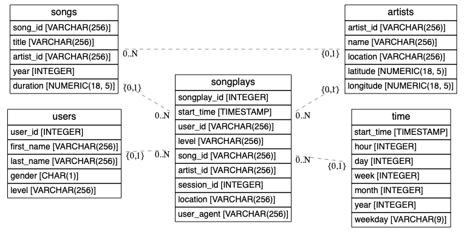

# Sparkify's Data Lake

The goal of this project is to build a data warehouse for the fictitious company Sparkify. We
want to build a data lake from songplay records and song metadata provided as JSON logs, such
that data scientists and analysts can more easily understand what songs their users are
listening to on the company's music streaming app in order to provide insights for critical
business decisions.

This solution is fundamentally different from the previous one, the
[data warehouse](../2_data-warehouse)) in that now we build a data lake using S3 for storage.
Our S3 based data lake will thus contain both the raw songplay records and song metadata, as
well as 5 pre-processed tables: songplays, users, songs, artists and time. We refer the
interested reader to the [warehouse's documentation](../2_data-warehouse/README.md) for
detailed description about this schema; below, we only display the schema diagram for quick
reference.



There is one important difference between the processed tables in this project schema and the
data warehouse's, though. Here, we partition some of the processed tables before storing
them, as follows:

- **songplays**: this table is written to the data lake partitioned by year and then by
month. So the paths look like
`s3:://path/to/songplays/year=2018/month=11/part-*.snappy.parquet`;
- **time**: also partitioned by year and then by month; for example,
`s3://path/to/time/year=2018/month=11/part-*.snappy.parquet`; 
-  **songs**: partitioned by year and then by artist ID; for example,
`s3://path/to/songs/year=2018/artist_id=ABCD1234/part-*.snappy.parquet`.

## Usage instructions

To run this project you will need an AWS EMR cluster configured to run pyspark in a Python 3
environment. Details about using Python 3 in AWS EMR clusters may be found in
https://aws.amazon.com/premiumsupport/knowledge-center/emr-pyspark-python-3x/.

You will also need to create a `dl.cfg` file which should look like the following:
```buildoutcfg
[AWS]
AWS_ACCESS_KEY_ID=<YOUR_ACCESS_KEY>
AWS_SECRET_ACCESS_KEY=<YOUR_SECRET_ACCESS_KEY>

[DL]
OUTPUT_PATH=<S3_PATH_WHERE_YOU_WILL_SAVE_THE_PROCESSED_TABLES>
```
where the AWS credentials above should have read access to the S3 bucket where you will save
the results.

Once your cluster is up, copy your `dl.cfg` file and the `etl.py` script to the master
node. You may then run the ETL pipeline with
```bash
spark-submit etl.py
```
